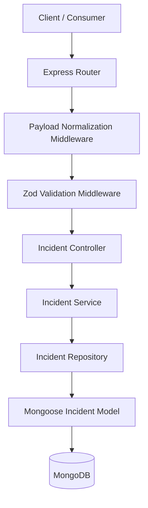

# Incident Management API

A production-grade, extensible, and high-performance backend service built with Node.js and Express for archiving, retrieving, and organizing AI-generated incident reports. It tracks metrics and configurations fetched from monitoring tools like Prometheus, log platforms like Kibana, and repositories like GitHub.

---

## Architecture Overview

The codebase is built on top of a highly maintainable, layered architectural pattern that decouples route parsing, schema validation, business coordination, and direct database persistence.



- **Payload Normalization Middleware**: Intercepts incident creation requests, stripping markdown wrappers, repairing unescaped quotes (using `jsonrepair`), and normalizing data formats before they hit schemas.
- **Controller**: Orchestrates input extraction from requests, calling the correct services, and writing HTTP success status response formats.
- **Service**: Executes core business computations, controls schema pagination math, and entity mappings.
- **Repository**: Encapsulates DB CRUD commands, applying performance utilities such as Mongoose `.lean()` for high-throughput reads.
- **Model**: Encodes database schema definitions, structure types, and handles index declarations.

---

## Folder Structure

```text
src/
├── config/
│   ├── database.js          # DB connection configuration and retry logic
│   └── swagger.js           # Swagger documentation spec generator
│
├── constants/
│   └── sourceTypes.js       # Allowed third-party source names
│
├── controllers/
│   └── incident.controller.js  # App request handlers
│
├── sanitizers/
│   ├── incidentSanitizer.js # Normalizes source names & trims strings recursively
│   └── jsonRepair.js        # Extracts JSON blocks & repairs syntax malformations
│
├── services/
│   └── incident.service.js     # Decoupled business rules
│
├── repositories/
│   └── incident.repository.js  # Database access layer
│
├── routes/
│   ├── incident.routes.js   # Incident endpoint bindings
│   └── health.routes.js     # Health probe binding
│
├── middleware/
│   ├── error.middleware.js     # Global error catching and response mapping
│   ├── validate.middleware.js  # Schema validate middleware using Zod
│   ├── payloadNormalization.middleware.js # Pre-validation normalizer
│   └── notFound.middleware.js  # 404 handler
│
├── validators/
│   └── incident.validator.js   # Route parameters and body Zod validations
│
├── models/
│   └── incident.model.js       # Incident Mongoose schema with indexes
│
├── utils/
│   ├── ApiResponse.js       # Consistent JSON success wrappers
│   ├── ApiError.js          # Custom HTTP error models
│   └── pagination.js        # Pagination metadata formatter
│
├── docs/
│   └── postman_collection.json # Ready-to-import Postman collections
│
├── app.js                   # Application middlewares and route definitions
└── server.js                # Database trigger listener, port listening, and graceful exit
```

---

## Environment Variables

Copy the `.env.example` file and customize your values:

```bash
PORT=3000
MONGODB_URI=mongodb://localhost:27017/incident_management
NODE_ENV=development
```

---

## Installation & Running

Ensure you have **Node.js (version 22+)** and **MongoDB** installed and running on your system.

### 1. Install Dependencies

```bash
npm install
```

### 2. Seed Data

Populates MongoDB with Prometheus, Kibana, GitHub, and mixed-source incident reports.

```bash
npm run seed
```

### 3. Run Locally (Development)

Runs the application using native Node `--watch` command.

```bash
npm run dev
```

### 4. Run Tests & Coverage

Runs the unit tests natively using the Node.js test runner and produces code coverage reports:

```bash
# Run all unit tests
npm test

# Run tests and show code coverage
npm run test:coverage
```

### 5. Running with Docker

Orchestrate the application and a MongoDB instance using Docker Compose:

```bash
docker-compose up --build
```

---

## API Specifications & Documentation

The interactive OpenAPI/Swagger user interface is hosted locally and can be accessed at:

```http
http://localhost:3000/api-docs
```

### Endpoints

| Method | Endpoint | Description |
| :--- | :--- | :--- |
| **GET** | `/health` | Application status probe and DB connection health checker |
| **POST** | `/api/v1/incidents` | Creates a new incident report |
| **GET** | `/api/v1/incidents` | Retrieves paginated incidents sorted in reverse chronological order |
| **GET** | `/api/v1/incidents/:id` | Retreives a specific incident by MongoDB ObjectId |

---

## Example Requests & Responses

### 1. Health Check

#### Request
```http
GET http://localhost:3000/health
```

#### Response (200 OK)
```json
{
  "status": "UP",
  "database": "CONNECTED",
  "timestamp": "2026-06-07T12:00:00.000Z"
}
```

---

### 2. Create Incident

#### Request
```http
POST http://localhost:3000/api/v1/incidents
Content-Type: application/json

{
  "heading": "Database connection pool exhaustion in checkout-service logs",
  "summary": "Multiple JedisConnectionException entries found in checkout-service logs, causing failures in transaction processing.",
  "sources": [
    {
      "name": "KIBANA",
      "description": "Kibana log query: checkout-service AND JedisConnectionException",
      "data": {
        "hits": 47,
        "sample": "Could not get a resource from the pool"
      }
    }
  ]
}
```

#### Response (201 Created)
```json
{
  "success": true,
  "message": "Incident created successfully",
  "data": {
    "id": "65f37efb8401ef6c1178229b"
  }
}
```

---

### 3. Get Incident by ID

#### Request
```http
GET http://localhost:3000/api/v1/incidents/65f37efb8401ef6c1178229b
```

#### Response (200 OK)
```json
{
  "success": true,
  "data": {
    "id": "65f37efb8401ef6c1178229b",
    "heading": "Database connection pool exhaustion in checkout-service logs",
    "summary": "Multiple JedisConnectionException entries found in checkout-service logs, causing failures in transaction processing.",
    "sources": [
      {
        "name": "KIBANA",
        "description": "Kibana log query: checkout-service AND JedisConnectionException",
        "data": {
          "hits": 47,
          "sample": "Could not get a resource from the pool"
        }
      }
    ],
    "createdAt": "2026-06-07T12:00:00.000Z",
    "updatedAt": "2026-06-07T12:05:00.000Z"
  }
}
```

---

### 4. Get All Incidents

#### Request
```http
GET http://localhost:3000/api/v1/incidents?page=1&limit=2
```

#### Response (200 OK)
```json
{
  "success": true,
  "pagination": {
    "page": 1,
    "limit": 2,
    "totalRecords": 4,
    "totalPages": 2,
    "hasNextPage": true,
    "hasPreviousPage": false
  },
  "data": [
    {
      "id": "65f37efb8401ef6c1178229d",
      "heading": "Checkout Service 500 Errors due to Redis Connection Pool Exhaustion",
      "summary": "A spike in 500 errors on checkout-service was detected by Prometheus, confirmed by JedisConnectionExceptions in Kibana logs, and correlated to recent GitHub PR configuration updates.",
      "sources": [
        {
          "name": "PROMETHEUS",
          "description": "Prometheus metrics showing increase in HTTP 500 errors.",
          "data": { "value": 154 }
        }
      ],
      "createdAt": "2026-06-07T12:10:00.000Z",
      "updatedAt": "2026-06-07T12:10:00.000Z"
    },
    {
      "id": "65f37efb8401ef6c1178229c",
      "heading": "Checkout Service deployment checkout-service-pr-142 fails on start",
      "summary": "Deployment logs show application crashes immediately after merging PR #142 containing Redis connection properties updates.",
      "sources": [
        {
          "name": "GITHUB",
          "description": "GitHub Pull Request: Update Redis configuration properties",
          "data": { "pr_number": 142 }
        }
      ],
      "createdAt": "2026-06-07T12:05:00.000Z",
      "updatedAt": "2026-06-07T12:05:00.000Z"
    }
  ]
}
```
